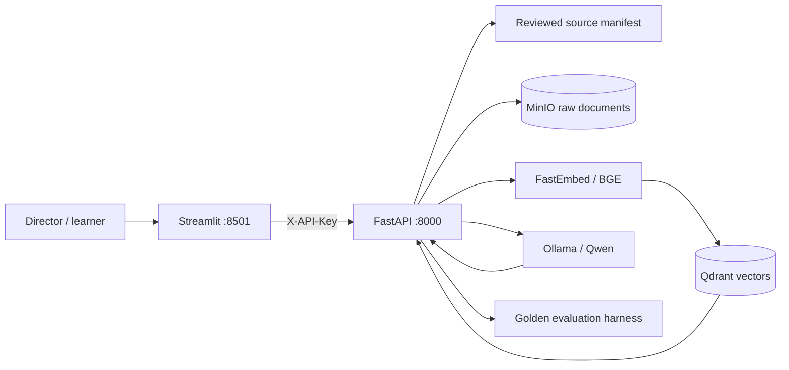

# Director's RAG Handbook

An open-source, citation-first learning lab that answers practical filmmaking questions while
showing **how** retrieval-augmented generation reached each answer. Project 1 compares naive RAG,
citation-first RAG, and a transparent Self-RAG-inspired retrieval/critique/retry loop.

> GitHub Pages can host this project's static documentation, but it cannot run Python, FastAPI,
> Streamlit, MinIO, Qdrant, or Ollama. The live application runs from the Docker stack on a server;
> Pages acts as its public showcase and can link to that deployment.

## What is included

- A Streamlit UI for chat, source ingestion, evidence inspection, and evaluation reports.
- A FastAPI service with authenticated versioned endpoints and interactive OpenAPI docs.
- Raw source snapshots stored in local S3-compatible MinIO object storage.
- Local BGE embeddings and cosine search in Qdrant.
- A local open-source chat model served by Ollama; no paid model API is required.
- A reviewed allowlist of openly licensed filmmaking material with source-level attribution.
- A version-controlled golden dataset and explainable quality metrics.
- Docker Compose, unit tests, linting/type checks, GitHub Actions CI, Pages docs, and GHCR releases.

## Architecture



The FastAPI layer owns application policy. MinIO preserves the exact bytes used for an index;
Qdrant stores chunks and provenance; Ollama generates without sending prompts to a third party.
The code uses small adapters so any one of those components can be replaced later.

## Repository structure

```text
directors-rag-handbook/
├── .github/workflows/
│   ├── ci.yml                 # lint, typing, tests, container build
│   ├── pages.yml              # publish the static project showcase
│   └── release.yml            # publish tagged containers to GHCR
├── data/
│   ├── eval/golden.jsonl      # version-controlled RAG evaluation cases
│   └── sources.yaml           # exact-URL OER allowlist and attribution
├── docs/
│   ├── index.md
│   ├── architecture.md
│   ├── evaluation.md
│   └── security.md
├── src/directors_rag/
│   ├── api/                   # FastAPI app, routes, dependencies, security
│   ├── domain/                # validated shared models
│   ├── evaluation/            # deterministic metrics and harness
│   ├── ingestion/             # safe loading, parsing, chunking, indexing
│   ├── rag/                   # prompts, Ollama client, RAG strategies
│   ├── retrieval/             # local embeddings and Qdrant adapter
│   ├── storage/               # MinIO adapter
│   ├── ui/                    # Streamlit application
│   └── config.py              # typed environment configuration
├── tests/                     # fast unit and API security tests
├── compose.yaml               # full local stack
├── Dockerfile                 # non-root Python runtime
├── mkdocs.yml                 # GitHub Pages documentation site
└── pyproject.toml             # package, tools, and dependency constraints
```

## Prerequisites

Install these on the development machine:

1. [Git](https://git-scm.com/downloads).
2. [Docker Desktop](https://www.docker.com/products/docker-desktop/) with Docker Compose v2.
3. At least 8 GB RAM (12–16 GB is more comfortable for the local LLM).

Python is not required for the Docker path. For IDE support or host-side tests, install Python
3.12 and create a virtual environment with `python -m venv .venv`.

## Run locally

PowerShell:

```powershell
Copy-Item .env.example .env
# Edit .env and replace both change-me secrets before exposing any port beyond localhost.
docker compose up -d minio qdrant ollama
docker compose --profile setup run --rm ollama-pull
docker compose up -d --build api ui
docker compose ps
```

Open:

- Streamlit: <http://localhost:8501>
- FastAPI docs (development only): <http://localhost:8000/docs>
- MinIO console: <http://localhost:9001>

In the Streamlit **Source library** tab, review and ingest individual sources. Model and embedding
downloads happen on first use and can take several minutes. Persistent Docker volumes keep raw
objects, vectors, and model weights between restarts.

To stop the services without deleting data:

```powershell
docker compose down
```

Do not add `-v` unless you intentionally want to delete all MinIO, Qdrant, and Ollama volumes.

## Publish and create a public endpoint

The repository publishes its static showcase through GitHub Pages. The live multi-container app must
run on a container host because Pages serves static files only. The recommended first deployment is
a Linux VPS using [compose.production.yaml](compose.production.yaml) and Caddy for automatic HTTPS.
Follow [docs/deployment.md](docs/deployment.md) for DNS, server commands, verification, updates, and
the production security checklist.

## RAG modes

| Mode | Retrieval | Citations | Query rewrite | Draft critique/retry |
|---|---:|---:|---:|---:|
| `naive` | one pass | optional | no | no |
| `cited` | one pass | required by prompt | no | no |
| `self_rag` | one or two passes | required | on weak retrieval | on weak grounding |

This implementation is deliberately described as **Self-RAG-inspired**. It exposes the useful
retrieve, assess, and retry pattern, but does not claim to reproduce the special reflection tokens
or training procedure from the Self-RAG research paper. The execution trace makes that distinction
visible to learners.

## API examples

All `/api/v1/*` routes require `X-API-Key`. Health liveness is public.

```powershell
$headers = @{ "X-API-Key" = "your-secret-from-env" }

Invoke-RestMethod -Headers $headers `
  -Uri http://localhost:8000/api/v1/sources

Invoke-RestMethod -Method Post -Headers $headers `
  -ContentType "application/json" `
  -Body '{"question":"How does blocking reveal character?","mode":"self_rag"}' `
  -Uri http://localhost:8000/api/v1/chat
```

Key endpoints:

| Method | Endpoint | Purpose |
|---|---|---|
| `GET` | `/health/live` | process liveness |
| `GET` | `/health/ready` | dependency and model readiness |
| `GET` | `/api/v1/sources` | inspect source provenance |
| `POST` | `/api/v1/sources/{id}/ingest` | index one reviewed source |
| `POST` | `/api/v1/chat` | ask with a selected RAG strategy |
| `POST` | `/api/v1/evaluations/run?mode=self_rag` | run the golden set |

## Source quality and copyright policy

The initial catalog favors institutional publishers, openly licensed textbooks, peer review, clear
authorship, practical relevance, and stable attribution pages. Popularity is not treated as proof of
quality. The app does not crawl the open web: ingestion accepts a stable source ID and the backend
resolves it to an exact checked-in HTTPS URL. Raw bytes are retained for reproducibility.

Most initial texts use `CC BY-NC-SA 4.0`; consequently, this content collection is intended for
non-commercial educational use. The Apache-2.0 license covers this repository's **code**, not third-
party documents. Review each source license before changing the use case or distributing a dataset.

## Evaluation

The evaluation harness reports answer relevance, expected-source recall, citation validity,
groundedness, latency, and pass rate. Metrics are deterministic and inspectable; they are regression
signals, not substitutes for expert review. Run it from the UI after sources are indexed, or call the
API endpoint. See [docs/evaluation.md](docs/evaluation.md) for limitations and extension points.

## Security baseline

The backend includes constant-time API-key checking, input validation, exact-URL allowlisting,
HTTPS-only ingestion, cross-host redirect blocking, response-size limits, prompt-context boundaries,
CORS/trusted-host controls, security headers, rate limiting, safe incident IDs, non-root containers,
and secrets loaded from the environment. See [SECURITY.md](SECURITY.md) and
[docs/security.md](docs/security.md) before any internet-facing deployment.

A shared API key is appropriate for a private demo, not multi-user production. Put the API behind an
HTTPS reverse proxy or identity-aware gateway, keep MinIO/Qdrant/Ollama off the public network, use a
real secret manager, and replace the in-memory limiter before public launch.

## Developer quality checks

```powershell
py -3.12 -m venv .venv
.\.venv\Scripts\Activate.ps1
python -m pip install -e ".[dev]"
ruff check .
ruff format --check .
mypy src
pytest --cov=directors_rag
```

CI runs the same checks and builds the image on every pull request. A `v*` Git tag publishes the
image to GitHub Container Registry. The docs workflow publishes this repository's showcase to
GitHub Pages after Pages is configured to use **GitHub Actions** as its source.

## Roadmap

- Project 2: isolated private PDF workspaces for financial statements and tax documents.
- Per-user authentication, tenant-scoped MinIO prefixes, and tenant filters in Qdrant.
- OCR for scanned PDFs, table-aware extraction, hybrid BM25/vector retrieval, and a reranker.
- Expert-labeled evaluation sets, model-graded checks, tracing, and deployment dashboards.

## License

Code is licensed under Apache-2.0. Source documents remain under their own licenses and attribution
requirements.
