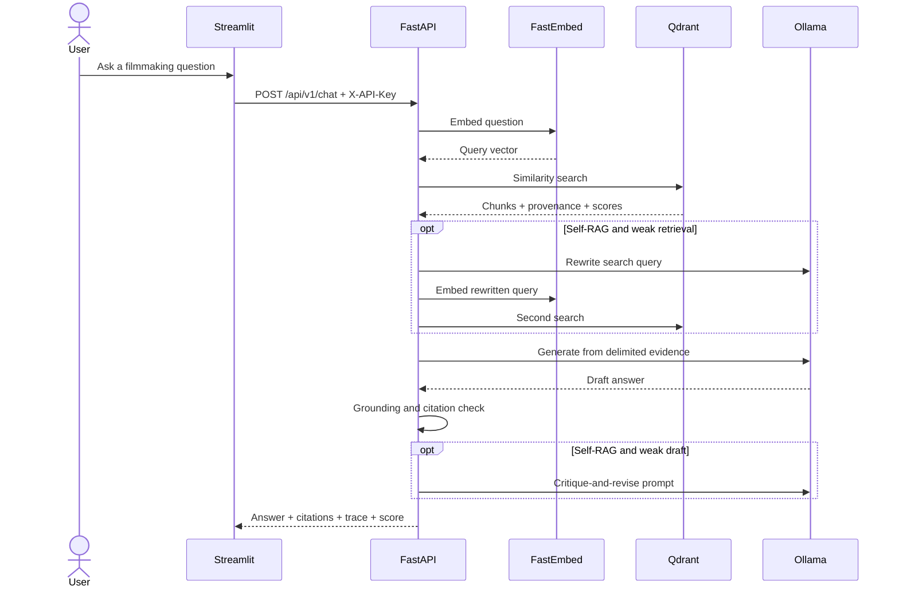

# Architecture

## Request path

## Ingestion path

The catalog is code-reviewed YAML. An administrator selects a source ID; the service resolves its
exact HTTPS URL, blocks cross-host redirects, limits response size, archives the raw bytes, extracts
semantic sections, creates deterministic overlapping chunks, embeds them locally, and upserts them
into Qdrant. Each chunk includes its source URL, license, page/heading, content hash, and stable ID.

## Module boundaries

- `domain` has no infrastructure dependencies beyond Pydantic.
- `ingestion` turns reviewed external material into domain chunks.
- `retrieval` isolates embedding and vector-database SDKs.
- `storage` isolates S3-compatible object persistence.
- `rag` owns prompts, model calls, grounding checks, and strategy orchestration.
- `evaluation` owns datasets and metrics, not production answer logic.
- `api` performs transport, authentication, configuration, and dependency wiring.
- `ui` is a thin API client and never talks directly to data stores.

This separation is intentional: Project 2 can introduce tenant-aware adapters without mixing private
document policy into the public handbook application.
